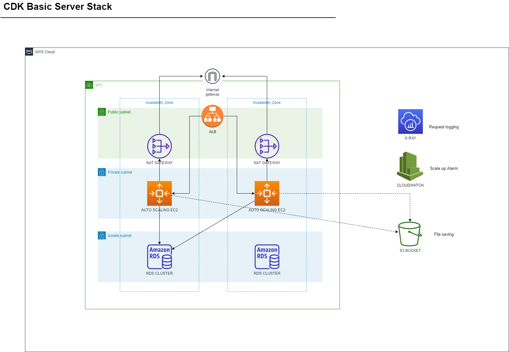

Basic server architecture

# Welcome to your CDK TypeScript project!



## Useful commands

useful user meta-data
```
sudo yum install -y httpd
sudo yum install -y wget
cd /home/ec2-user
wget https://bucket-name.s3.amazonaws.com/latest/install
chmod +x ./install
sudo ./install auto
```
